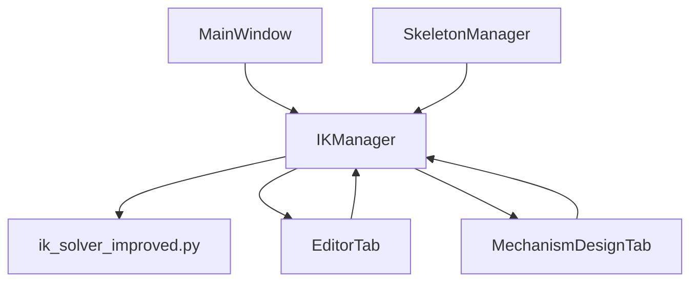

# IK Solver Usage Analysis - Complete Codebase Map

## Executive Summary

**CURRENT STATE:** The application uses a unified IK system through `IKManager`, with all IK solving routed through `ik_solver_improved.py`. The old `ik_solver.py` is **NOT being used** anywhere in the active codebase.

## IK Architecture Overview

### Primary IK System
- **Manager:** `src/automataii/kinematics/ik_manager.py` (Single source of truth)
- **Solver:** `src/automataii/kinematics/ik_solver_improved.py` (Active solver)
- **Legacy:** `src/automataii/kinematics/ik_solver.py` (Unused, can be removed)

### Integration Pattern
```
MainWindow
├── IKManager (singleton instance)
│   ├── Uses: ik_solver_improved.solve_ik_fabrik_with_constraints
│   └── Aliased as: solve_ik_ccd (for backward compatibility)
├── EditorTab (consumer)
└── MechanismDesignTab (consumer)
```

## Detailed Usage Mapping

### 1. Core IK Implementation

#### ik_solver_improved.py
- **Primary Function:** `solve_ik_fabrik_with_constraints()` (line 80)
- **Alias:** `solve_ik_ccd = solve_ik_fabrik_with_constraints` (line 331)
- **Status:** ✅ ACTIVE - Used by IK Manager

#### ik_solver.py (LEGACY)
- **Function:** `solve_ik_ccd()` (line 17)
- **Internal:** `_solve_ik_fabrik()` (line ~60)
- **Status:** ❌ UNUSED - No imports found in active codebase

### 2. IK Manager (Central Coordinator)

**File:** `src/automataii/kinematics/ik_manager.py`

**Key Import:**
```python
# Line 1255
from ..kinematics.ik_solver_improved import solve_ik_fabrik_with_constraints as solve_ik_ccd
```

**Usage:**
```python
# Line 1327
solve_ik_ccd(chain, target_pos, original_lengths, 
            bend_directions=self.sim_joint_bend_directions, 
            iterations=10, tolerance=1.0)
```

**Consumer Components:**
- Editor Tab (character animation)
- Mechanism Design Tab (mechanism IK)
- Main Window (coordination)

### 3. GUI Integration Points

#### MainWindow (Primary Integration)
**File:** `src/automataii/gui/main_window.py`

**IK Manager Integration:**
- **Instantiation:** `self.ik_manager = IKManager(self)` (line 90)
- **Skeleton Link:** `self.ik_manager.set_skeleton_manager(self.skeleton_manager)` (line 148)
- **Signal Connections:** Lines 253-256, 999-1221

#### EditorTab (Character Animation Consumer)
**File:** `src/automataii/gui/tabs/editor_tab.py`

**IK Manager Usage (via Main Window reference):**
- **Connection:** `self._connect_to_ik_manager()` (line 175)
- **Data Updates:** Lines 1813-1830 (part data, skeleton data, motion paths)
- **Animation Control:** Requests forwarded to IK Manager

#### MechanismDesignTab (Mechanism IK Consumer)
**File:** `src/automataii/gui/tabs/mechanism_design_tab.py`

**IK Manager Usage (via Main Window reference):**
- **Connection:** `self._connect_to_ik_manager()` (line 487)
- **Mechanism Control:** Lines 1343-1405 (mechanism setup, target setting)
- **Animation Management:** Lines 1437-4002 (play/stop/reset)

## IK Solver Selection Strategy

### Current Implementation
```python
# In ik_manager.py
from ..kinematics.ik_solver_improved import solve_ik_fabrik_with_constraints as solve_ik_ccd
```

**Why FABRIK over CCD:**
1. **Better Convergence:** FABRIK typically converges faster than CCD
2. **Constraint Support:** Enhanced constraint handling in improved version  
3. **Stability:** More stable for character animation use cases
4. **Backward Compatibility:** Aliased as `solve_ik_ccd` for existing code

### Algorithm Used
- **Primary:** FABRIK (Forward And Backward Reaching Inverse Kinematics)
- **Constraints:** Joint angle limits, bend directions
- **Fallback:** None (single solver strategy)

## Cross-Component Data Flow



## Verification Results

### Active IK Components ✅
1. **IKManager:** Single instance in MainWindow
2. **ik_solver_improved.py:** Primary solver implementation
3. **solve_ik_fabrik_with_constraints:** Core algorithm function

### Unused Components ❌
1. **ik_solver.py:** No imports found (can be safely removed)
2. **Direct solver imports:** All IK goes through IKManager
3. **Multiple solver strategies:** Single FABRIK implementation

### Integration Points ✅
1. **EditorTab:** Uses IK Manager for character animation
2. **MechanismDesignTab:** Uses IK Manager for mechanism control
3. **MainWindow:** Coordinates all IK operations

## Potential Issues & Recommendations

### Issue: Single Point of Failure
- **Risk:** All IK depends on one solver implementation
- **Mitigation:** Consider fallback solver for critical operations

### Issue: Legacy Code References
- **Risk:** Code comments/docs may reference old CCD implementation
- **Action:** Update documentation to reflect FABRIK usage

### Recommendation: Cleanup Opportunities
1. **Remove:** `ik_solver.py` (confirmed unused)
2. **Rename:** `solve_ik_ccd` alias to `solve_ik_fabrik` for clarity
3. **Document:** FABRIK algorithm choice rationale

## Testing Requirements

### Critical Test Cases
1. **Character Animation:** Full skeleton IK solving
2. **Mechanism Control:** Joint target reaching
3. **Constraint Handling:** Joint limits and bend directions
4. **Performance:** IK solving speed under animation load

### Integration Test Scenarios
1. **Editor → IK Manager → Solver:** Character pose updates
2. **Mechanism → IK Manager → Solver:** Mechanism target updates
3. **Cross-tab:** Data synchronization between editor and mechanism tabs

## Conclusion

The IK system architecture is **well-unified and consistent**. All IK operations flow through a single `IKManager` instance using the improved FABRIK solver. The old CCD solver is completely unused and can be safely removed. The system follows a clean separation of concerns with proper abstraction layers.

**Status:** ✅ ARCHITECTURE VERIFIED - Single, consistent IK pipeline across all components.