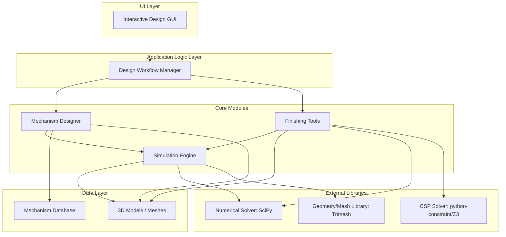
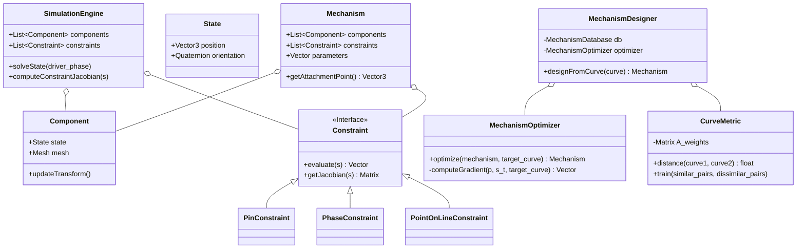

Here is a detailed, reproducible implementation plan for the "Computational Design of Mechanical Characters" paper, structured for a software engineering team.

---

## 1. System Overview

### 1.1. Key Technical Contributions
The paper presents an interactive system that automates the complex process of designing and fabricating animated mechanical characters. The core technical contributions are:
1.  **Motion to Mechanism Synthesis**: A novel two-stage process that translates a user-sketched motion curve into an optimized, parameterized physical mechanism that can reproduce it.
2.  **Constraint-Based Simulation Core**: A unified, constraint-based simulation engine that handles both forward kinematics for animation and inverse kinematics for optimization, capable of simulating complex assemblies including kinematic loops.
3.  **Learnable Curve Similarity Metric**: A feature-based distance metric for comparing motion curves, with weights that are trained from user feedback to align with perceptual similarity.
4.  **Automated Finishing Pipeline**: A set of semi-automated tools for connecting individual mechanisms with gear trains, resolving collisions via a layering system, and generating support structures for fabrication.

### 1.2. System Input, Output, and Goals
*   **Input**:
    1.  A 3D model of an articulated character (e.g., in `.obj` or `.stl` format).
    2.  User-sketched 2D or 3D motion curves that define the desired trajectory for specific points on the character.
    3.  A library of pre-defined, parameterized mechanism types (e.g., four-bar linkages).
*   **Output**:
    1.  A complete, manufacturable 3D model of the mechanical assembly (character + mechanisms + gears + supports).
    2.  The assembly is driven by a single input actuator and performs the user-defined cyclic motions.
*   **Goal**: To empower non-expert users to design and fabricate complex, custom-animated mechanical toys and characters by automating the difficult engineering steps.

---

## 2. Algorithm & Model Decomposition

### 2.1. Constraint-Based Assembly Simulation (Section 3)
This is the core physics engine. It solves for the state (position and orientation) of all components such that a set of geometric constraints is satisfied.

*   **Model**:
    *   Each component `i` has a 6-DOF state `s_i = {T_i, α_i, β_i, γ_i}` where `T` is translation and `α,β,γ` are Euler angles.
    *   Constraints are formulated as a vector function `C(s)` which equals zero when all constraints are met.
*   **Algorithm**:
    1.  At each time step (or for a given input driver phase), solve the nonlinear least-squares problem:
        `min ||C(s)||^2`
    2.  **Implementation**: Use a standard Newton-Raphson or Levenberg-Marquardt solver. This requires computing the Jacobian of the constraint vector `C` with respect to the state vector `s`.
        *   `Δs = - (J^T J)^-1 J^T C(s)`, where `J = ∂C/∂s`.
        *   Iterate `s ← s + Δs` until `||C(s)||^2` is below a tolerance.
    3.  **Constraint Types**: Each constraint type (Pin, PointOnLine, Phase, FixedState) contributes a set of scalar equations to the global vector `C`. For example, a `PinConnection` between components `i` and `j` adds 5 scalar equations, constraining the relative translation and two axes of rotation.

### 2.2. Mechanism Design (Section 4)
This module finds a mechanism to match a user's sketched curve.

*   **Step 1: Coarse Search (Database Lookup)**
    1.  **Pre-computation**: For each parameterized mechanism type in the library, generate a large set of sample motions using Poisson-disk sampling in the *metric space* of the output curves (as defined in Sec 5). This ensures a diverse set of motions is captured.
    2.  **Database**: Store a mapping: `(mechanism_type, parameters) -> representative_motion_curve`.
    3.  **Query**: When a user provides a target curve, search the database to find the `representative_motion_curve` with the minimum distance (using the Curve Metric) to the target curve. The corresponding `(mechanism_type, parameters)` is the result.

*   **Step 2: Continuous Parameter Optimization**
    1.  **Goal**: Fine-tune the parameters `p` of the mechanism found in the coarse search to better match the target curve `x_target`.
    2.  **Objective Function**: Minimize `F(p) = ∫ ||x(p, s_t) - x_target_t||^2 dt`, where `x(p, s_t)` is the position of the marker point at time `t` for a mechanism with parameters `p`.
    3.  **Solver**: Use a quasi-Newton method like **BFGS**, which requires the gradient `∂F/∂p`.
    4.  **Gradient Calculation (Implicit Function Theorem)**: The key challenge is calculating `∂s_t/∂p`. Instead of costly finite differences on the full simulation, the paper uses the Implicit Function Theorem. Since `C(p, s_t(p)) = 0`, we have:
        `∂s_t/∂p = - (∂C/∂s_t)^-1 (∂C/∂p)`
        *   `∂F/∂p` can now be computed analytically.
        *   `∂C/∂s_t` (the constraint Jacobian) is computed analytically.
        *   `∂C/∂p` is computed efficiently using finite differences, as it doesn't require re-solving the system.

### 2.3. Curve Similarity Metric (Section 5)
Defines a perceptually-relevant distance between two curves.

*   **Model**: The distance `d(c_i, c_j)` is a weighted norm on feature differences:
    `d^2 = (f_i - f_j)^T A (f_i - f_j)`
    where `f` is the feature vector and `A` is a diagonal, positive semi-definite matrix of weights.
*   **Features**:
    *   Global: Normalized length, area, ellipticity, anchor position, orientation, self-intersections.
    *   Local (Pairwise): Minimum L2 distance of vertex positions and curvatures, after aligning starting points.
*   **Metric Training**: The weights in `A` are learned by solving a constrained optimization problem (using Sequential Quadratic Programming - SQP) based on user-provided labels:
    *   **Minimize**: Sum of distances for "similar" pairs.
    *   **Subject to**: Distances for "dissimilar" pairs must be greater than a threshold `γ`.

### 2.4. Finishing: Gears and Layers (Section 6)
*   **Gear Optimization**: Connects mechanisms to a single driver. This is formulated as a nonlinear constrained optimization problem (solved with SQP) to find gear positions and radii.
    *   **Objective**: Minimize deviation from target radii.
    *   **Constraints**: Equations for meshing, alignment, and non-intersection.
*   **Collision-Free Layering**: Assigns planar components to discrete layers to avoid collisions.
    *   **Model**: This is a classic Constraint Satisfaction Problem (CSP).
    *   **Variables**: `layer_index` for each component.
    *   **Constraints**:
        1.  `layer(A) ≠ layer(B)` if components A and B collide.
        2.  `layer(C) < layer(A) OR layer(C) > layer(B)` if C is a pin connecting A and B.
    *   **Solver**: A standard CSP solver like Walksat or a modern SMT/SAT solver.

---

## 3. Software Architecture Design

A modular, layered architecture is ideal. This separates the core physics from the higher-level design logic.

### 3.1. Architecture Diagram (Mermaid)



### 3.2. Module Interaction Flow
1.  **User Interaction**: The `UI Layer` captures user input (sketches, model loading) and sends it to the `Design Workflow Manager`.
2.  **Mechanism Design**:
    *   The `Workflow Manager` invokes the `Mechanism Designer`.
    *   The `Mechanism Designer` queries the `Mechanism Database` using the `CurveMetric`.
    *   It then uses the `Simulation Engine` and a `Numerical Solver` to run the BFGS optimization with the implicit gradient.
3.  **Finishing**:
    *   The `Workflow Manager` invokes the `Finishing Tools` module.
    *   The `Gear Optimizer` uses a `Numerical Solver` (SQP) to lay out the gear train.
    *   The `Layering Tool` uses a `CSP Solver` to assign collision-free layers.
4.  **Simulation & Visualization**: At all stages, the `Simulation Engine` is used to compute the state of the assembly for animation and analysis, using the `Geometry Library` for component data.

---

## 4. Class and Module Design

### 4.1. Key Classes (UML Diagram - Mermaid)



### 4.2. Class Responsibilities
*   **`SimulationEngine`**: Manages the global state of an assembly. Its primary job is to run the constraint solver.
*   **`Component`**: Represents a single rigid body. Holds its 3D mesh data and its current state (position/orientation).
*   **`Constraint` (and subclasses)**: Encapsulates the mathematics for a specific type of geometric constraint. Must provide methods to evaluate the constraint error vector and its Jacobian.
*   **`Mechanism`**: A self-contained collection of components and constraints that forms a functional unit (e.g., a linkage). It is defined by a set of high-level parameters `p`.
*   **`MechanismDesigner`**: Orchestrates the two-stage design process: coarse search followed by optimization.
*   **`MechanismOptimizer`**: Implements the BFGS optimization loop, including the crucial implicit gradient calculation.
*   **`CurveMetric`**: Computes the distance between curves and handles the logic for training the metric weights.

---

## 5. Implementation Plan (Code-Level)

### 5.1. Suggested Stack
*   **Language**: **Python 3.13+** (for its rich scientific computing ecosystem).
*   **Core Libraries**:
    *   **`NumPy`**: For all vector and matrix operations.
    *   **`SciPy`**: For numerical solvers.
        *   `scipy.optimize.minimize(method='BFGS')` for mechanism optimization.
        *   `scipy.optimize.minimize(method='SLSQP')` for the gear and metric training constrained optimizations.
        *   `scipy.interpolate.Rbf` for non-circular gear profiles.
    *   **`Trimesh`**: For loading/handling 3D meshes, computing bounding boxes, swept volumes, and performing collision checks.
    *   **`python-constraint` or `z3-solver`**: For the collision-free layering CSP.

### 5.2. Pseudo-code for Key Components

#### MechanismOptimizer Gradient Calculation

```python
# Inside MechanismOptimizer class
def _compute_gradient(self, p, target_curve):
    # p: current mechanism parameters
    # target_curve: user's sketch

    total_gradient = np.zeros_like(p)

    for t in time_steps:
        # 1. Get current state s_t for parameters p at time t
        s_t = self.simulation_engine.solveState(p, driver_phase=t)

        # 2. Compute partial derivatives for the Implicit Function Theorem
        # dC_ds is the constraint Jacobian, computed analytically
        dC_ds = self.simulation_engine.computeConstraintJacobian(s_t)

        # dC_dp is computed via finite differences (cheap)
        dC_dp = self.simulation_engine.computeConstraintParamJacobian(p, s_t)

        # 3. Solve the linear system: (dC/ds) * X = -(dC/dp)
        # Use pseudo-inverse for stability
        dC_ds_inv = np.linalg.pinv(dC_ds)
        ds_dp = -dC_ds_inv @ dC_dp

        # 4. Compute the final gradient of the objective function F
        marker_pos = self.mechanism.getAttachmentPoint(s_t)
        error = marker_pos - target_curve.point_at(t)

        # Chain rule: dF/dp = dF/dx * (dx/ds * ds/dp + dx/dp)
        dx_ds = self.mechanism.getAttachmentPointJacobianWrtState(s_t)
        dx_dp = self.mechanism.getAttachmentPointJacobianWrtParams(p)

        gradient_at_t = error @ (dx_ds @ ds_dp + dx_dp)
        total_gradient += gradient_at_t

    return total_gradient / len(time_steps)
```

---

## 6. Supporting Documentation

### 6.1. Notes on Edge Cases and Stability
*   **Gimbal Lock**: The paper notes that the Euler angle representation can suffer from gimbal lock. The implementation should include a mechanism to re-parameterize the orientation (e.g., by swapping axes) when a singularity is approached. Quaternions should be used for internal state representation to avoid this, converting to Euler angles only when necessary.
*   **Solver Convergence**: The Newton-Raphson and BFGS solvers are not guaranteed to converge, especially with poor initial guesses. The database search is critical for providing a good starting point. Implementations should include max iteration limits and report convergence failures.
*   **Rank Deficiency**: The constraint Jacobian `∂C/∂s` can become rank-deficient in over- or under-constrained systems. Using the Moore-Penrose pseudo-inverse (`np.linalg.pinv`) instead of a standard inverse provides robustness.

### 6.2. API Usage Example

```python
# --- 1. Setup ---
# Load mechanism database (pre-computed)
db = MechanismDatabase.load('data/linkage_db.json')
metric = CurveMetric.load('data/trained_metric.pkl')
db.set_metric(metric)

# Load character model
character_mesh = trimesh.load('models/character.obj')

# --- 2. Design ---
# User provides a sketched curve (e.g., from a UI)
target_curve = Curve(points=user_sketch_points)

# Find the best initial mechanism from the database
initial_mech = db.find_best_match(target_curve)

# Fine-tune the mechanism
optimizer = MechanismOptimizer(simulation_engine)
optimized_mech = optimizer.optimize(initial_mech, target_curve)

# --- 3. Finishing ---
# (Assuming multiple mechanisms have been designed)
gear_optimizer = GearTrainOptimizer(simulation_engine)
gear_train = gear_optimizer.connect_mechanisms([mech1, mech2], driver)

# Assign layers to avoid collision
all_components = optimized_mech.components + gear_train.components
layer_solver = LayerSolver()
layer_assignments = layer_solver.assign_layers(all_components)

# --- 4. Fabrication ---
# Export final assembly with layered components
export_to_stl(all_components, layer_assignments, 'final_character.stl')
```

### 6.3. Test Strategy
*   **Unit Tests**: Each `Constraint` subclass should be tested to ensure its `evaluate` and `getJacobian` methods are correct (use numerical differentiation to check analytical Jacobians). The `CurveMetric` features should also have unit tests.
*   **Integration Tests**: Test the full pipeline on simple, known cases. For example, a target curve that is a perfect circle should result in a simple crank-slider mechanism with predictable parameters.
*   **Validation**: Re-create one of the simpler examples from the paper, like the *Pushing Man*, and visually verify that the motion is correct.

---

## 7. Reproducibility Checklist

1.  **Environment Setup**:
    *   Python 3.9+
    *   Initialize uv project: `uv init automataii`
    *   Navigate to project: `cd automataii`
    *   Add dependencies: `uv add numpy scipy trimesh matplotlib python-constraint`
    *   **`pyproject.toml` dependencies section**:
        ```toml
        [dependencies]
        numpy = "*"
        scipy = "*"
        trimesh = "*"
        matplotlib = "*"
        python-constraint = "*"
        ```

2.  **Pre-computation Step (Database Generation)**:
    *   Provide a script `generate_database.py`.
    *   **Usage**: `python generate_database.py --mechanism_type four_bar --samples 3000 --output data/four_bar_db.json`
    *   This script will instantiate the specified mechanism with random parameters, simulate its motion, compute the curve features, and save the `(params, curve_features)` pair to the database, using Poisson-disk sampling to ensure diversity.

3.  **Metric Training**:
    *   Provide a simple UI or script `train_metric.py` that presents pairs of curves to a user.
    *   The user labels pairs as "similar" or "dissimilar".
    *   The script saves the learned weight matrix `A` to a file (e.g., using `pickle`).

4.  **Re-run Instructions**:
    *   Provide a main script `main.py` that loads a pre-defined target curve and runs the full design pipeline.
    *   **Usage**: `python main.py --target_curve_path data/test_curves/simple_oval.csv --output_dir results/oval_character`
    *   The script should output the final 3D model and a video/GIF of the resulting animation, allowing for direct comparison with expected results.