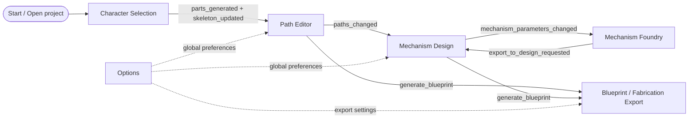

# Platform Rebuild UI/UX Porting Flow

This document is the UI/UX and product-flow source of truth for rebuilding
Automataii on another platform. It deliberately leaves all existing documents in
place and links to them as historical design evidence, implementation notes, and
release/deployment references.

Use this when the goal is a total rebuild, not a small Qt refactor. The new
platform may be web, native desktop, tablet, or a hybrid app, but it must preserve
the same user promises:

- users can load or choose a character, edit its skeleton/parts, and draw motion
  paths;
- users can explore and tune mechanisms separately from the character;
- mechanisms can be attached to character parts without screen-to-screen drift;
- visual handles, numeric parameters, animation, and blueprint output stay 1:1;
- fabrication export reflects the actual board, character, mechanism count, and
  placement, not a generic recipe.

## 1. Product mental model

Automataii has three nested products in one app:

1. **Character authoring**: turn an image into movable body parts and a skeleton.
2. **Motion authoring**: define how body parts should move, then attach mechanisms
   that produce that motion.
3. **Fabrication authoring**: convert the current scene into printable/cuttable
   parts and an assembly guide for the physical kit.

A rebuild should expose those products as a staged workflow, while keeping the
underlying state shared and inspectable.

## 2. Current screen map

The Qt app currently creates these workflow surfaces in
`src/automataii/presentation/qt/main_window.py`:

| Order | Current object | User-facing name | Rebuild responsibility |
| --- | --- | --- | --- |
| 1 | `ImageProcessingTab` / `tab_character_selection` | Character Selection | Choose sample or image, run segmentation/BPE, emit parts and skeleton. |
| 2 | `EditorTab` / `tab_path_editor` | Path Editor | Arrange parts, edit skeleton, draw motion paths, preview IK motion. |
| 3 | `MechanismDesignTab` / `tab_mechanism_design` | Mechanism Design | Attach mechanisms to paths/parts, parametric-edit mechanisms, preview animation. |
| 4 | `MechanismFoundryView` / `tab_mechanism_foundry` | Mechanism Foundry | Explore mechanism families, tune recipes, export selected mechanism into design. |
| Menu/dialog | `OptionsTab` / `tab_options` | Options | Global animation timing, theme, toolbar, blueprint format, autosave, panel visibility. |
| Export flow | Blueprint/exporter classes | Blueprint package | Current-scene printable/fabrication output and assembly instructions. |

Do not rebuild the old `MainWindow` as another god object. Treat it as an
orchestration map: it shows which events exist today and which state each screen
expects.

## 3. Architecture to preserve

Keep the clean architecture boundary. The new UI can be rewritten completely, but
it should consume the same concepts.

| Layer | Preserve as | Must not depend on |
| --- | --- | --- |
| Domain | Pure mechanism, skeleton, animation, and geometry computation. | UI toolkit, canvas, filesystem dialogs. |
| Application | Use cases, managers, state models, adapters, validation. | Specific widget classes in a new platform. |
| Presentation | Screens, canvas, handles, drag/drop, dialogs, visual feedback. | Hidden business rules that should live in application/domain. |
| Infrastructure | persistence, export generation, event bus, validation adapters. | Screen-local state assumptions. |
| Shared | `Result`, `Point2D`, physical-kit constants, fabrication contracts. | Toolkit-specific types. |

### Rebuild rule

Port headless contracts first, then UI. A successful rebuild can run these flows
without rendering a UI:

1. load `parts_info.json`, `char_cfg.yaml`, and assets;
2. normalize the character to the target print sheet;
3. transform skeleton, path, and mechanism coordinates through one scene frame;
4. create/update a mechanism from parameters;
5. export a fabrication package from the current design state.

## 4. Canonical state owners

The rebuild should collapse cross-screen data into an explicit app state store.
The current Qt code already has a partial single source of truth through
`ProjectStateManager`; use that as the model and avoid screen-local duplicates.

| State | Current owner | Rebuild owner | Notes |
| --- | --- | --- | --- |
| Raw project files and directories | `ProjectDataManager` | Project loader service | Knows where `parts_info.json`, `char_cfg.yaml`, masks, and part assets live. |
| Cross-tab project state | `ProjectStateManager` | Global state store | Immutable-style state with parts, skeleton, paths, mechanisms, metadata. |
| Standard skeleton | `SkeletonManager` | Skeleton service/slice | Converts Animated Drawings data into app skeleton format. |
| IK animation runtime | `IKManager` and editor handlers | Animation service | Runtime-only; should not be the persistence source. |
| Part/path editing scene | `EditorTab` + `EditorTabAdapter` | Editor feature module | Emits paths and part/skeleton edits as state actions. |
| Mechanism layer scene | `MechanismDesignTab` + adapter | Mechanism design feature module | Uses state mechanisms and paths; owns only transient selection/drag state. |
| Foundry exploration state | `MechanismFoundryController/View` | Foundry feature module | Design-time recipes and previews; exports a mechanism spec. |
| Fabrication output | blueprint/export services | Export service | Reads current state only; never guesses generic placement. |
| Physical kit profile | `PhysicalKitContext`, `physical_kit.py` | App settings + shared constants | 2 cm grid and Letter sheet assumptions must be explicit. |

## 5. Data contracts required by every platform

### 5.1 Character project package

A character package is the output of Character Selection and the input to every
other screen.

Required files and fields:

- `parts_info.json`
  - part id/name;
  - `texture_path` or legacy `image_path`;
  - `mask_path` when available;
  - `anchor_joint`;
  - transform: `x`, `y`, `rotation`, `scale`;
  - `z_index`, opacity, fixed/visibility-like flags;
  - optional ROI/bounding box and effective bbox offsets;
  - optional original/enhanced SVG paths;
  - optional `local_pivot_offset`.
- `char_cfg.yaml`
  - Animated Drawings-style skeleton source;
  - joints, hierarchy/root ids, limb lengths, source metadata.
- `mask.png`
  - whole-character mask if generated.
- part assets
  - individual PNG/SVG body parts referenced by `parts_info.json`.

Load-time UX requirements:

- show a clear stage: selecting, processing, loading, normalizing, ready;
- if `char_cfg.yaml` or `parts_info.json` is missing, block with a recoverable
  error and a file path;
- normalize to the configured print sheet before the user starts editing;
- do not preserve old dummy mechanisms during a plain image load; preserve/rebind
  only during an explicit dummy replacement flow.

### 5.2 Standardized skeleton

The app-wide skeleton should be represented independently from the source file.

Minimum fields:

- `joints`: keyed by joint id, with x/y position, display name, parent id,
  lock state, and `bend_direction` defaulting to `1.0` if absent;
- `bones`: ordered pairs of joint ids;
- `root_joint` or `root_joint_ids`;
- `joint_map`: semantic name to id;
- `hierarchy`: parent id to child id list;
- `metadata`: source format, scale, image bounds, and normalization information.

UX requirements:

- skeleton visuals must match between Path Editor and Mechanism Design;
- adding/removing joints must update hierarchy and body-part anchors atomically;
- missing optional fields must not crash rendering;
- locked joints and bend direction must be visible and editable.

### 5.3 Body part/layer data

A body part is both a visual layer and a semantic animation target.

Minimum fields:

- stable id/name;
- asset references;
- transform in canonical scene coordinates;
- local pivot/anchor offset;
- z/layer order;
- associated skeleton joint;
- hit-test region or rendered bounds;
- visibility/lock/selectability;
- optional group/semantic role.

UX requirements:

- users can add/remove/reorder layers;
- users can define or reassign body parts directly;
- changing a part anchor updates the skeleton relationship and animation preview;
- part positions shown in the editor are exactly the positions used by mechanisms
  and exports.

### 5.4 Motion path data

Path data flows from Path Editor into Mechanism Design.

Minimum fields:

- `part_name` or stable part id;
- ordered points in canonical scene coordinates;
- optional timed points: x/y/time;
- total duration;
- closed/open flag;
- enabled flag;
- source metadata: drawn by user, generated by mechanism, imported.

UX requirements:

- path visibility can be toggled without deleting data;
- paths appear in Mechanism Design at the same location as Path Editor;
- path edits emit one state action and update all subscribers;
- invalid/too-short paths show warnings rather than silently failing.

### 5.5 Mechanism data

A mechanism layer is an instance, not a type bucket. Two four-bar mechanisms must
export as two separate instances.

Minimum fields:

- stable mechanism id;
- mechanism type/canonical type, for example `four_bar`, `4_bar_linkage`, `cam`,
  `gear`, `planetary_gear`;
- target `part_name` or body-part ids;
- parameters and real-world parameters;
- key points in canonical scene coordinates;
- transform and scene anchor;
- active visual part ids;
- generated output path if available;
- Foundry snapshot/source metadata if exported from Foundry;
- fabrication metadata: board coordinates, grid pitch, required parts, validation
  warnings;
- enabled/visible state.

UX requirements:

- drag handles and numeric parameters update each other 1:1;
- parametric-editing overlays are cleaned up when leaving edit mode;
- during editing, prefer rough animation feasibility and warnings over strict
  physical rejection;
- strict validation belongs at fabrication/export time;
- if a mechanism can only rotate through a safe partial range, show that angle
  range instead of pretending it supports 360 degrees.

### 5.6 Foundry export package

Foundry is a mechanism sandbox. It exports a recipe into the character design.

Minimum fields:

- mechanism id or generated instance id;
- mechanism type;
- parameter map;
- selected output/pivot point;
- generated path points and simulation summary when available;
- visual configuration: pivot point, scale, color scheme, constraints visible;
- animation configuration: duration, steps, loop flag;
- metadata: source tab, timestamp, selected preset/recommendation, warnings.

UX requirements:

- Foundry export should ask where the mechanism lands only when the target cannot
  be inferred;
- if exported to Mechanism Design, the first rendered position must match the
  Foundry preview anchor;
- bidirectional parameter sync should never overwrite an unrelated mechanism with
  the same type.

### 5.7 Blueprint/fabrication package

Blueprint export must read the current design state and generate physical output.
It must not create a generic one-of-each mechanism guide.

Minimum output concepts:

- current scene snapshot;
- one fabrication recipe per mechanism instance;
- board coordinates in a declared origin frame;
- grid pitch, sheet size, hole diameter, physical profile key;
- required parts/cut list and quantities;
- assembly steps with coordinate roles and visual highlights;
- printable PDFs/SVGs for kit parts and assembly guide;
- machine-readable metadata for future import/debugging.

Current physical assumptions to make explicit in the new platform:

- default grid pitch: 20 mm / 2 cm;
- Letter page: 8.5 in x 11 in, or 215.9 mm x 279.4 mm;
- default board: 15 x 15 cells;
- board label frame: A1 top-left for SVG/manual pages;
- app-centered frame: H8 at origin for scene/board-centered calculations.

## 6. Screen-by-screen rebuild specification

### 6.1 Character Selection

**User goal:** choose a sample character or load an image and convert it into a
riggable character package.

**Entry condition:** app has no character, an existing project is open, or user
chooses to replace the current character.

**Required inputs:** source image or sample id; processing settings; optional
replacement context.

**Primary actions:**

1. choose sample/load image;
2. run image processing/segmentation;
3. review generated parts and skeleton;
4. accept or fix skeleton/part detection;
5. emit `parts_generated(annotation_results, final_output_dir)`;
6. emit `skeleton_updated(raw_skeleton_data)` when skeleton changes.

**State updates:**

- write/copy `parts_info.json`, `char_cfg.yaml`, `mask.png`, part assets;
- load project package into project state;
- normalize character to print sheet;
- update standardized skeleton;
- clear stale editor/mechanism caches unless this is an explicit replacement.

**Exit transitions:**

- success: go to Path Editor;
- processing failure: remain here with recoverable error;
- replacement success: go to previous workflow stage with rebinding summary.

**Porting notes:**

- keep processing progress visible;
- preserve the distinction between plain image load and dummy-character
  replacement;
- do not let image-processing output become screen-local only.

### 6.2 Path Editor

**User goal:** make the character editable, align skeleton/parts, draw paths, and
preview body motion.

**Entry condition:** project has parts and a standardized skeleton.

**Required inputs:** parts, skeleton, current global settings, optional existing
paths.

**Primary actions:**

1. select/move/rotate/scale body parts;
2. add/remove/edit skeleton joints;
3. define/reassign body-part anchors;
4. add/remove/reorder visual layers;
5. draw or edit paths on parts;
6. play/stop/reset simulation;
7. save alignment;
8. request blueprint export.

**State updates:**

- part transforms and layer order;
- skeleton joints, hierarchy, locks, bend directions;
- path data per part;
- alignment metadata.

**Exit transitions:**

- to Mechanism Design once paths or target parts exist;
- to Blueprint export when user requests fabrication output;
- back to Character Selection if reprocessing/replacement is needed.

**Porting notes:**

- the editor canvas is the canonical coordinate reference for parts/skeleton;
- one 2 cm grid renderer should be shared with Mechanism Design and export
  previews;
- body parts must stay in a convenient editable location after sheet
  normalization, not hidden at an arbitrary origin;
- simulation visuals must not mutate persistent part/skeleton data unless the
  user explicitly saves alignment.

### 6.3 Mechanism Foundry

**User goal:** explore mechanisms independently, understand their motion, and
send a selected recipe into the character design.

**Entry condition:** app can run without a character, but export-to-design works
best when a character/project is active.

**Required inputs:** mechanism family, preset/recommendation, parameter values,
physical-kit profile.

**Primary actions:**

1. choose mechanism family: four-bar/linkage, cam-follower, gear, planetary gear;
2. pick preset or recommendation;
3. drag/edit parameters;
4. preview generated path and constraints;
5. inspect feasibility warnings;
6. export selected mechanism to Mechanism Design.

**State updates:**

- Foundry-local preview parameters;
- optional synchronized mechanism parameters if editing an exported instance;
- export package on handoff.

**Exit transitions:**

- export creates or updates one mechanism instance in Mechanism Design;
- failed feasibility remains in Foundry with warnings and editable params.

**Porting notes:**

- recommendation dialogs must use the same permissive edit-time feasibility rules
  as parametric editing;
- four-bar range display should show actual safe partial rotation when 360-degree
  motion is not feasible;
- do not collapse multiple same-type mechanisms into one export item.

### 6.4 Mechanism Design

**User goal:** attach mechanisms to character parts/paths, edit them directly,
preview motion, and send the final design to fabrication.

**Entry condition:** project has character parts; paths are optional but should be
visible if present.

**Required inputs:** parts, skeleton, path data, mechanism instances, physical-kit
settings, optional Foundry export package.

**Primary actions:**

1. add mechanism manually or from Foundry;
2. choose target part/path/anchor;
3. drag mechanism into place;
4. enter parametric editing mode;
5. edit handles and numeric fields;
6. preview animation;
7. remove/disable mechanism;
8. request blueprint export.

**State updates:**

- one mechanism instance per layer;
- parameter map and key points;
- target part/path mapping;
- generated path or output motion;
- validation warnings;
- transient selection/drag state only in the UI module.

**Exit transitions:**

- to Foundry for deeper mechanism exploration;
- to Blueprint export for fabrication;
- to Path Editor when source paths or skeleton/part anchors need fixing.

**Porting notes:**

- all displayed handles must be generated from the same mechanism state that is
  persisted and exported;
- handle drag lifecycle should be: start from current state, preview local change,
  commit a state action, then re-render from state;
- stale edit handles should be removed on mode exit, mechanism selection change,
  character reload, and mechanism deletion;
- screen position, board position, and export position must use one transform
  pipeline;
- strict fabrication constraints should not block rough animation layout.

### 6.5 Options

**User goal:** tune global behavior without losing current work.

**Required settings:**

- animation duration;
- timing profile;
- theme;
- toolbar visibility;
- part properties panel visibility;
- autosave settings;
- blueprint/export format;
- physical-kit profile and grid pitch when exposed.

**Porting notes:**

- settings should be app-global and observable by all screens;
- changing grid pitch must update editor grid, mechanism grid, and blueprint
  export together;
- settings changes should not mutate project data unless explicitly saved as
  project metadata.

### 6.6 Blueprint / Fabrication Export

**User goal:** obtain printable and machine-readable instructions that match the
current design.

**Entry condition:** current project has at least one character or mechanism; full
fabrication output needs mechanism instances with enough placement data.

**Required inputs:** project state, mechanism instances, physical-kit settings,
export format, output directory.

**Primary actions:**

1. validate current design for export;
2. show warnings/errors with mechanism ids and screen links;
3. compose per-instance fabrication recipes;
4. generate board assembly steps;
5. generate PDFs/SVGs and metadata files;
6. open output folder or show package summary.

**Porting notes:**

- warnings should be specific: mechanism id, part, missing coordinate, incompatible
  gear/link length, out-of-sheet element;
- duplicate mechanism types must remain distinct instances;
- board coordinates must reflect scene placement and chosen grid pitch;
- export should include enough metadata to reload or debug the fabrication state.

## 7. Cross-screen event/action contract

Use actions or events like these in the new state store. Names can change, but the
semantics should not.

| Event/action | Producer | Consumers | Payload |
| --- | --- | --- | --- |
| `parts_generated` | Character Selection | project loader, Editor, Mechanism Design | annotation results and output directory. |
| `skeleton_updated` | Character Selection or Editor | Skeleton service, Editor, Mechanism Design | raw or standardized skeleton data. |
| `parts_changed` | project state | Editor, Mechanism Design, export | map of body parts. |
| `skeleton_changed` | project state | Editor, Mechanism Design, IK runtime | standardized skeleton. |
| `path_data_changed` | Editor | project state | map of part to path. |
| `motion_path_updated` | Editor | project state | one part path. |
| `paths_changed` | project state | Mechanism Design, export | normalized path map. |
| `request_generate_mechanism` | Mechanism Design | mechanism generator service | mechanism type and parameters. |
| `mechanism_parameters_changed` | Mechanism Design or Foundry | project state, peer screen | mechanism id and params. |
| `mechanism_path_generated` | Mechanism Design | project state | generated output path. |
| `export_to_design_requested` | Foundry | Mechanism Design | mechanism id/type/params/pivot. |
| `request_generate_blueprint` | Editor or Mechanism Design | export service | current project state and settings. |
| `options_changed` | Options | app state and relevant screens | changed setting key/value. |

## 8. Coordinate, scale, and grid policy

A rebuild should define this once and test it heavily.

### Required coordinate frames

1. **Asset-local frame**: pixels/SVG coordinates inside a body-part asset.
2. **Part-local frame**: asset after pivot/local offset normalization.
3. **Scene frame**: canonical app coordinate system for editor and mechanism
   design.
4. **Sheet frame**: physical print page in millimeters.
5. **Board frame**: 15 x 15 grid with either top-left labels or centered app
   origin.
6. **Export frame**: PDF/SVG output coordinates.

### Required transforms

- asset-local -> part-local;
- part-local -> scene;
- scene -> sheet mm;
- scene -> board centered mm;
- board label -> SVG top-left;
- mechanism key points -> scene -> board/export.

### UX requirements

- show the 2 cm grid consistently in Path Editor, Mechanism Design, and
  fabrication previews;
- normalize characters to Letter sheet bounds while keeping them easy to edit;
- expose the scale factor in debug/details UI;
- use the same transform functions for rendering, hit testing, dragging,
  animation, and export;
- never maintain separate hidden scale math per screen.

## 9. Validation model

Separate validation by moment:

| Moment | Validation style | UX |
| --- | --- | --- |
| Character load | strict for required files, permissive for optional metadata | block only when the project cannot load. |
| Skeleton/part editing | permissive with visible warnings | let users fix structure interactively. |
| Path drawing | permissive | warn on too-short or disconnected paths. |
| Mechanism parametric editing | animation-first, rough feasibility | update screen and numbers 1:1; warn instead of rejecting most edits. |
| Mechanism recommendation | same as parametric editing | avoid recommending recipes that immediately fail in design. |
| Blueprint export | strict physical/fabrication validation | block only the invalid export, with exact ids and recovery links. |

For four-bar/linkage mechanisms, do not assume a full rotation. Compute or sample
the feasible motion range, show that angle range, and allow partial-cycle previews
when the mechanism is otherwise useful.

## 10. Rebuild implementation sequence

Follow this order to avoid recreating the current cross-screen drift problems.

1. **Headless state and contracts**
   - define project state schema;
   - implement loaders for current project packages;
   - implement state actions/reducers;
   - write snapshot tests for load/save round trips.
2. **Coordinate and physical units**
   - implement shared transform service;
   - implement 2 cm grid and Letter sheet constants;
   - test scene/sheet/board/export conversions.
3. **Character Selection**
   - keep image processing as backend service or port it behind the same output
     contract;
   - render processing states and recoverable errors.
4. **Path Editor**
   - build canvas, selection, layers, skeleton editing, path editing;
   - connect all changes to project state actions.
5. **Mechanism engine adapter**
   - expose mechanism computation through a small API;
   - support four-bar partial-range sampling;
   - return warnings separately from hard errors.
6. **Mechanism Foundry**
   - rebuild recipes/recommendations and preview;
   - export one instance package at a time.
7. **Mechanism Design**
   - consume paths and Foundry exports;
   - implement direct manipulation with state-backed handles;
   - keep parametric overlays disposable and deterministic.
8. **Blueprint/Fabrication export**
   - compose from current state;
   - enforce physical validation at export;
   - include per-instance assembly metadata.
9. **Project persistence and compatibility**
   - load old projects;
   - write a new versioned project format;
   - include migrations for missing optional fields.
10. **Release hardening**
    - run end-to-end scenarios;
    - test packaged builds on each target platform;
    - keep release notes linked to changed UX contracts.

## 11. New platform UI modules to create

A practical module breakdown for a rebuild:

- `app-shell`
  - navigation, global actions, settings, project open/save, update/release UI;
- `project-store`
  - state schema, actions, selectors, undo/redo, persistence bridge;
- `character-selection`
  - sample picker, image import, processing status, skeleton review handoff;
- `scene-canvas`
  - shared renderer, layers, grid, sheet bounds, hit testing, drag lifecycle;
- `skeleton-editor`
  - joints, bones, hierarchy, bend direction, anchor assignment;
- `part-layer-editor`
  - body part creation, deletion, transforms, z-order/layers;
- `path-editor`
  - drawing, smoothing, timing capture, path list and warnings;
- `mechanism-engine-client`
  - mechanism compute API, warnings, feasible ranges, generated paths;
- `mechanism-foundry`
  - recipes, recommendations, isolated preview, export package;
- `mechanism-design`
  - instance list, parameter panels, direct handles, animation preview;
- `fabrication-export`
  - validation, assembly steps, PDFs/SVGs, metadata output;
- `diagnostics`
  - state inspector, coordinate inspector, trace/log viewer.

## 12. Acceptance scenarios for parity

The rebuild is not equivalent until these scenarios pass.

1. **Load sample character**
   - sample loads;
   - parts fit within Letter sheet;
   - skeleton appears in both Path Editor and Mechanism Design at the same place.
2. **Load custom character**
   - generated files are copied/linked;
   - missing optional skeleton fields do not crash;
   - scale normalization is reported.
3. **Edit skeleton and parts**
   - add/remove joint;
   - define/reassign body part;
   - reorder layers;
   - save and reload without losing relationships.
4. **Draw path and consume it in mechanism design**
   - path drawn on a limb appears in Mechanism Design at the identical scene
     location;
   - toggling visibility does not delete it.
5. **Create four-bar from Foundry**
   - recommendation previews;
   - partial feasible angle range is shown when 360 degrees is invalid;
   - export lands at the selected design location.
6. **Parametric direct editing**
   - handle position and numeric fields stay 1:1;
   - dragging updates actual mechanism state;
   - leaving edit mode removes all temporary handles.
7. **Multiple same-type mechanisms**
   - create two four-bar mechanisms;
   - both appear in design, animation, project state, and blueprint export.
8. **Animation parity**
   - Path Editor and Mechanism Design use the same skeleton/part transforms;
   - limbs do not detach or rotate from a stale coordinate frame.
9. **Blueprint placement parity**
   - board positions reflect mechanism positions;
   - output is not generic;
   - assembly guide lists per-instance steps and quantities.
10. **Cross-platform package**
    - app can load/save projects and export fabrication output from a clean
      install on each target platform.

## 13. Pitfalls not to repeat

- Do not duplicate character, skeleton, path, and mechanism state inside each
  screen.
- Do not let rendering coordinates differ from dragging/export coordinates.
- Do not use mechanism type as a unique key; use mechanism instance id.
- Do not reject most parametric edits during drag; warn first, validate strictly
  only for export.
- Do not leave temporary handles/points alive after mode exit.
- Do not have Foundry recommendations use different feasibility rules than
  Mechanism Design.
- Do not generate fabrication guides from canned templates when scene placement
  exists.
- Do not bury physical assumptions such as grid pitch and Letter size in UI code.

## 14. Existing documentation to keep and consult

These documents remain part of the project record:

- [`docs/mechanism-blueprint-manual.md`](mechanism-blueprint-manual.md) — user-facing
  blueprint/fabrication manual.
- [`docs/deployment.md`](deployment.md) and
  [`docs/macos-distribution.md`](macos-distribution.md) — release and packaging
  references.
- [`docs/z_axis_layering.md`](z_axis_layering.md) — layer ordering behavior.
- [`docs/adr/`](adr/) — architecture decision records.
- [`docs/prd/`](prd/) — product requirements and refactor plans.
- [`docs/analysis/`](analysis/) — historical audits and migration analyses.
- [`docs/observability/`](observability/) — scenario telemetry and diagnostics.
- [`docs/sessions/`](sessions/) — previous implementation session summaries.

## 15. Current implementation inventory for porting

Use these files as evidence for current behavior. Port the behavior and contracts,
not the widget structure.

| Area | Current files | What to extract |
| --- | --- | --- |
| App shell/orchestration | `src/automataii/presentation/qt/main_window.py` | Tab order, signal map, project-load pipeline, global options routing. |
| Character Selection | `src/automataii/presentation/qt/tabs/image_processing_tab.py`, `src/automataii/application/project/adapters/image_processing.py` | Input package creation, `parts_generated`, `skeleton_updated`, sample/custom image flow. |
| Project load/state | `src/automataii/application/project_data_manager.py`, `src/automataii/application/project/models.py`, `src/automataii/application/project/state_manager.py`, `src/automataii/application/project/serializer.py` | Project schema, immutable state shape, load/save compatibility. |
| Skeleton | `src/automataii/application/managers/skeleton_manager.py`, `src/automataii/presentation/qt/graphics_items/skeleton_item.py` | Standardized skeleton conversion, hierarchy, bend direction, visual warnings. |
| Path Editor | `src/automataii/presentation/qt/tabs/editor/tab.py`, `src/automataii/presentation/qt/views/editor_view.py`, `src/automataii/application/project/adapters/editor.py` | Scene editing, part/layer behavior, path events, simulation controls. |
| Mechanism Design | `src/automataii/presentation/qt/tabs/mechanism_design/`, `src/automataii/presentation/qt/tabs/parametric_editing_manager.py`, `src/automataii/application/mechanism_design/`, `src/automataii/application/project/adapters/mechanism_design.py` | Mechanism layers, parameter editing, path consumption, animation preview. |
| Mechanism Foundry | `src/automataii/presentation/qt/tabs/mechanism_foundry/`, `src/automataii/application/mechanism_foundry/` | Recommendations, standalone simulation, export-to-design package. |
| Mechanism transfer | `src/automataii/application/mechanism_transfer/contract.py`, `src/automataii/application/mechanism_transfer/spec.py` | Cross-screen mechanism package and supported type aliases. |
| Blueprint/export | `src/automataii/presentation/qt/blueprint/`, `src/automataii/application/managers/blueprint_manager.py`, `src/automataii/application/fabrication/assembly_export.py`, `src/automataii/shared/fabrication_assembly.py` | Current-scene export, assembly recipe schema, board coordinate conversion. |
| Physical kit | `src/automataii/shared/physical_kit.py` | 2 cm grid, Letter sheet, 15x15 board, gear/cam/linkage physical presets. |
| Observability | `docs/observability/` | Scenario names and evidence to preserve in a new telemetry/QA harness. |

## 16. What each screen must show before handoff

| Screen | Must show | Must collect/store before user leaves |
| --- | --- | --- |
| Character Selection | source image/sample, processing progress, generated parts, skeleton overlay, errors with file paths | output directory, generated files, raw skeleton, normalization decision, replacement/plain-load context. |
| Path Editor | Letter sheet bounds, 2 cm grid, part layers, skeleton, selected part, path list, simulation controls | part transforms, layer order, skeleton edits, path points/timing, alignment save state. |
| Mechanism Foundry | mechanism family, preset/recommendation, parameter controls, preview path, feasibility/warning panel, export target | mechanism type, params, pivot/output point, feasible range, generated path, source metadata. |
| Mechanism Design | character, same grid and sheet frame, paths, mechanism instance list, selected instance handles, numeric params, warnings | instance id, target part/path, params, key points, scene anchor, generated output path, fabrication metadata. |
| Blueprint Export | validation summary, mechanism instance list, board placement preview, output formats, destination | physical profile, grid pitch, one recipe per instance, assembly steps, output file manifest. |
| Options | current global settings and whether they affect project or app only | animation timing, theme, toolbar/panel visibility, export format, autosave, physical-kit profile. |

## 17. Handoff gates and required information

The rebuild should make transitions explicit. A screen may allow the user to move
forward with warnings, but it must not move forward with missing required state.

| Handoff | Required information | Warning-only issues | Blocking issues |
| --- | --- | --- | --- |
| Character Selection -> Path Editor | project directory, parts, assets, skeleton or explicit no-skeleton state, scale normalization | missing optional mask, missing optional bend direction, low confidence part label | missing `parts_info.json`, missing asset file, unreadable skeleton when skeleton is required. |
| Path Editor -> Mechanism Design | parts in scene frame, current skeleton, optional paths, selected target context | short path, no path yet, unlocked/ambiguous joints | no parts loaded, corrupt coordinate transform. |
| Foundry -> Mechanism Design | mechanism type, params, pivot/output point, generated instance id or new id | partial rotation, fabrication incompatibility, path approximation | unsupported mechanism type, non-finite parameter, missing pivot. |
| Mechanism Design -> Blueprint Export | all enabled mechanism instances, scene transforms, physical profile, grid pitch | off-sheet but movable item, partial motion, non-fabricable draft mechanism | missing per-instance id, no board coordinate for required axle, invalid physical dimensions. |
| Any screen -> Save Project | project metadata, parts, skeleton/path/mechanism state serializable to JSON | runtime-only cache dropped | unserializable required field, missing project path on save-overwrite. |

## 18. QA checklist for the rebuild team

Create automated tests or scripted QA for these exact checks:

- project package round trip preserves part transforms, skeleton hierarchy, paths,
  and mechanism instance ids;
- all screens use the same scene-to-sheet and scene-to-board transform;
- the 2 cm grid visually aligns with exported board coordinates;
- a missing `bend_direction` becomes a safe default and never crashes rendering;
- plain image load clears old mechanism state while dummy replacement preserves
  and rebinds intentionally;
- parametric drag emits one committed state update and re-renders from state;
- Foundry recommendation, Foundry export, manual add, and numeric editing share
  the same mechanism validation API;
- blueprint export creates separate recipes for duplicate same-type mechanisms;
- a four-bar mechanism with partial valid motion displays the actual angle range;
- packaged builds include sample characters, image-processing assets, and export
  templates on every target platform.

When rebuilding, treat this file as the top-level UX flow contract and use the
linked documents for details, constraints, and prior trade-offs.
